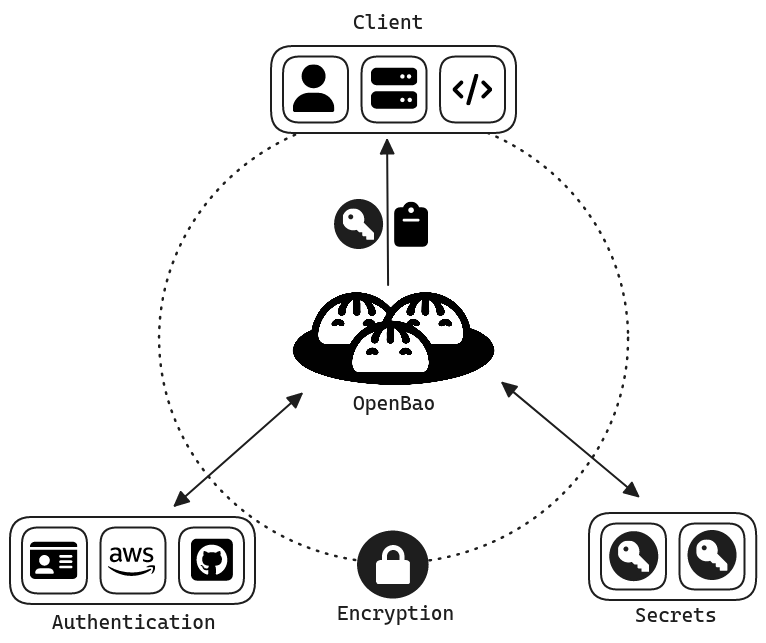

# Storing secrets locally using OpenBao
## Motivation
In terms of DevSecOps, security must be managed by the team developing the product. It is therefore important to store secrets securily. By using OpenBao as a local docker container, a team can manage secrets safely and locally.

## Background
This tutorial will mainly utilize OpenBao, which is a fork of HashiCrop Vault that provides a powerful secrets and encryption management server to store secrets such as passwords, encryption keys, and certificates. 
OpenBao utilizes an intersting concept know as Shamir Secret Sharing, this is a cryptographic algorithm that splits a secret into multiple parts, this means mutliple persons holds the "unseal" key used to make OpenBao accessible. "Unseal" in this context means essentially that OpenBao is in a working state and secrets can be retreived. Interesting to continue explore, but that will not be the purpose of this tutorial. With this in mind, we will use dev mode where only one key is required. To communicate with the server, it can be through a UI, a CLI, or by sending http api requests directly to the server which we will do in this tutorial.




## Tutorial Overview
In this tutroial, we will first introduce an insecure example of using plaintext or hardcoded secrets in a Python program. This would show a quick solution, but not a long time secure solution.

Then, we continue with showing how these secrets can be exchanged with a secure solution that controls the storage of secrets, using OpenBao. Here, OpenBao will be run in a docker container, and commands will be sent to the container in order to communicate with it.

```
        Start
          |
+---------v------------+ : Motivation and Background
|        Intro         | : Tutorial Overview
+----------------------+ : ILO
          |
+---------v------------+ : Setup database
| An insecure solution | : Setup Python Virtual environment
+----------------------+ : Connect to DB using python
          |
+---------v------------+ : Setup OpenBao
|  A secure solution   | : Store Secret in OpenBao
+----------------------+ : Retrieve secret using python http request
          |
+---------v------------+ : Summary
|       Summary        | : Recap
+----------------------+ : Take away
          |
          v
         End
 ```

## Intended Learning Outcomes
By the end of this tutorial, you should be able to:
- Setup a password protected mysql database container
- Understand how OpenBao and tokens works
- Setup your own OpenBao container that uses special policies and tokens to store a secret
- Retrieve a secret from OpenBao using its HTTP api
- Explain one good and one bad practice of storing secrets locally 
